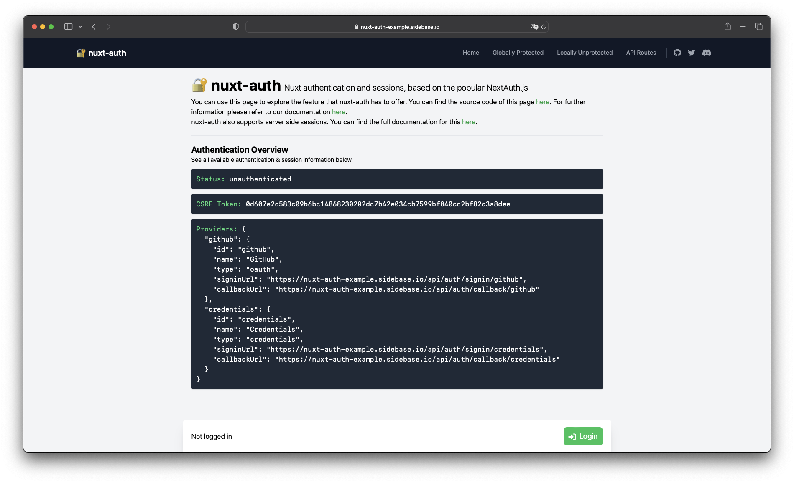

# 🔐 nuxt-auth

[![npm version][npm-version-src]][npm-version-href]
[![npm downloads][npm-downloads-src]][npm-downloads-href]
[](https://GitHub.com/sidebase/nuxt-auth/)
[![License][license-src]][license-href]
[](https://twitter.com/sidebase_io)
[](https://discord.gg/NDDgQkcv3s)

> `nuxt-auth` is a feature-packed, open-source authentication module for Nuxt 3 applications.
> Starting with v0.6 `nuxt-auth` also supports static Nuxt applications

## Quick Start

```sh
npx nuxi@latest module add sidebase-auth
```

Then visit the [Quick Start documentation](https://sidebase.io/nuxt-auth/getting-started/quick-start) to setup the module for <= v0.5 - the current stable version.

Visit the [Quick Start documentation](https://sidebase.io/nuxt-auth/v0.6/getting-started/quick-start) to setup the module for >= v0.6 - the "future" experimental version with support for static Nuxt 3 apps and the `local` provider.

## Features

`nuxt-auth` is a library with the goal of supporting authentication for any universal Nuxt 3 application. At the moment two providers are supported:
- [Auth.js / NextAuth.js](https://github.com/nextauthjs/next-auth) to offer the reliability & convenience of a 12k star library to the nuxt 3 ecosystem with a native developer experience (DX)
- `local` for static pages that rely on an external backend with a credential flow for authentication. `local` is supported starting with v0.6 of the module

Features of the `authjs`-provider of `nuxt-auth` include:
- ✔️ Authentication providers:
    - ✔️ OAuth (e.g., Github, Google, Twitter, Azure, ...)
    - ✔️ Custom OAuth (write it yourself)
    - ✔️ Credentials (password + username)
    - ✔️ Email Magic URLs
- ✔️ Isomorphic / Universal Auth Composable `useAuth` supports:
    - actions: `getSession`, `getCsrfToken`, `getProviders`, `signIn`, `signOut`
    - getters: `status`, `data`, `lastRefreshedAt`
    - full typescript support for all methods and property
- ✔️ Application-side middleware protection
- ✔️ Server-side middleware and endpoint protection
- ✔️ Advanced features for session life-cycle management:
    - Refresh the session periodically
    - Refresh the session on tab-refocus
    - One time session fetch on page load, afterwards for specific actions (e.g., on navigation)
    - 🚧 Session broadcasting between tabs (see #70)
- ✔️ Persistent sessions across requests
- ✔️ REST API:
    - `GET /signin`,
    - `POST /signin/:provider`,
    - `GET/POST /callback/:provider`,
    - `GET /signout`,
    - `POST /signout`,
    - `GET /session`,
    - `GET /csrf`,
    - `GET /providers`

You can find a feature-table of all starting with v0.6 in the [nuxt-auth "next"-version-docs](https://sidebase.io/nuxt-auth/v0.6/getting-started).

## Demo Page

Visit the [`nuxt-auth` demo page here](https://nuxt-auth-example.sidebase.io/):


You can find the [demo source-code here](https://github.com/sidebase/nuxt-auth-example).

## Development

This project uses `pnpm` for development.

- Run `pnpm dev:prepare` to generate type stubs.
- Use `pnpm dev` to start [the module playground](./playground) in development mode.
- Run `pnpm lint` to run eslint
- Run `pnpm typecheck` to run typescheck via tsc
- Run `pnpm publish --access public` to publish (bump version before)

<!-- Badges -->
[npm-version-src]: https://img.shields.io/npm/v/@sidebase/nuxt-auth/latest.svg
[npm-version-href]: https://npmjs.com/package/@sidebase/nuxt-auth

[npm-downloads-src]: https://img.shields.io/npm/dt/@sidebase/nuxt-auth.svg
[npm-downloads-href]: https://npmjs.com/package/@sidebase/nuxt-auth

[license-src]: https://img.shields.io/npm/l/@sidebase/nuxt-auth.svg
[license-href]: https://npmjs.com/package/@sidebase/nuxt-auth

### Module Playground

This module also has it's own playground:
```sh
> git clone https://github.com/sidebase/nuxt-auth

> cd nuxt-auth

# **OPEN THE `~/playground/server/api/auth/[...].ts` and configure your own auth-provider

> pnpm i

> pnpm dev:prepare

> pnpm dev

# -> open http://localhost:3000
```

#### Testing different Providers

We have one playground per provider:
- [`local`](./playground-local)
- [`authjs`](./playground-authjs)

**How to test static Nuxt 3 apps?**

To test static Nuxt 3 apps we want to run a static frontend and a separate backend that will take over authentication:
1. `playground-local/nuxt.config.ts`: Add `baseURL: 'http://localhost:3001'` to the `auth`-config
2. Start the static frontend:
    ```sh
    cd playground-local

    pnpm generate

    pnpm start
    ```
3. Start the authentication backend (we use a second instance of the same nuxt3 app):
    ```sh
    cd playground-local

    pnpm dev

    # A seconds Nuxt app should now be running on http://localhost:3001. We use this purely for authentication
    ```
4.  Visit [http://localhost:3000](http://localhost:3000) -> this should open the static application. Performing any auth-related actions, the app should send requests to the backend running on port `3001`  
