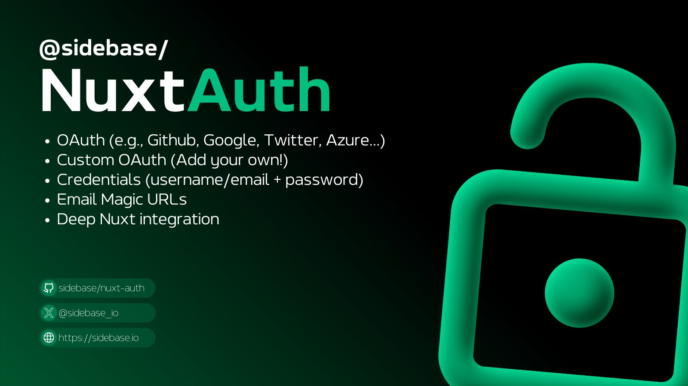

# @sidebase/nuxt-auth

<!-- Badges Start -->
<p>
  <a href="https://npmjs.com/package/@sidebase/nuxt-auth">
    
  </a>
  <a href="https://npmjs.com/package/@sidebase/nuxt-auth">
    
  </a>
  <a href="https://github.com/sidebase/nuxt-auth/stargazers">
    
  </a>
  <a href="https://github.com/sidebase/nuxt-auth/blob/main/LICENSE">
    
  </a>
  <a href="https://auth.sidebase.io">
    
  </a>
  <a href="https://x.com/sidebase_io">
    
  </a>
  <a href="https://discord.gg/NDDgQkcv3s">
    
  </a>
</p>
<!-- Badges End -->

> Authentication built for Nuxt 3! Easily add authentication via OAuth providers, credentials or Email Magic URLs!

## Quick Start

```sh
npx nuxi@latest module add sidebase-auth
```

<details>
  <summary>Or install manually</summary>

  #### 1. Install the package as a dev dependency

  ```sh
  npm i -D @sidebase/nuxt-auth

  pnpm i -D @sidebase/nuxt-auth

  yarn add --dev @sidebase/nuxt-auth
  ```

  #### 2. Add the modules to your `nuxt.config.ts`

  ```ts
  export default defineNuxtConfig({
    modules: ['@sidebase/nuxt-auth']
  })
  ```
</details>

Then visit the [Quick Start documentation](https://auth.sidebase.io/guide/getting-started/introduction) to continue the configuration of your app!

## Features

`@sidebase/nuxt-auth` is a library with the goal of supporting authentication for any universal Nuxt 3 application. At the moment three providers are supported:
- [`authjs`](https://auth.sidebase.io/guide/authjs/quick-start): for non-static apps that want to use [Auth.js / NextAuth.js](https://github.com/nextauthjs/next-auth) to offer the reliability & convenience of a 23k star library to the Nuxt 3 ecosystem with a native developer experience (DX)
- [`local`](https://auth.sidebase.io/guide/local/quick-start): for static pages that rely on an external backend with a credential flow for authentication. The Local Provider also supports refresh tokens since `v0.9.0`. Read more [here](https://auth.sidebase.io/upgrade/version-0.9.0).

You can find a full list of our features, as well as which provider supports each feature [on our docs](https://auth.sidebase.io/guide/getting-started/choose-provider).

### Authentication providers:
- OAuth (e.g., Github, Google, Twitter, Azure, ...)
- Custom OAuth (write it yourself)
- Credentials (password + username)
- Email Magic URLs

### Application Side Session Managment using [`useAuth`](https://auth.sidebase.io/guide/application-side/session-access#useauth-composable)
- Session fetching with `status`, `data` and `lastRefreshedAt`
- Methods to `getSession`, `getCsrfToken`, `getProviders`, `signIn` and `signOut`
- Full TypeScript support for all methods and properties

### Application protection
- Application-side middleware protection for the [full application](https://auth.sidebase.io/guide/application-side/protecting-pages#global-middleware) or [specific pages](https://auth.sidebase.io/guide/application-side/protecting-pages#local-middleware)
- Server-side [middleware](https://auth.sidebase.io/guide/authjs/server-side/session-access#server-middleware) and [endpoint protection](https://auth.sidebase.io/guide/authjs/server-side/session-access#endpoint-protection)

### Advanced features for session life-cycle management:
- Pre-built and [customizable refresh behaviour](https://auth.sidebase.io/guide/application-side/configuration#sessionrefresh)
  - Refresh the session periodically
  - Refresh the session on tab-refocus
  - One time session fetch on page load, afterwards for specific actions (e.g., on navigation)
- Completly configure the Refresh behaviour of your application using the [`RefreshHandler`](https://auth.sidebase.io/guide/application-side/configuration#refreshhandler)

### Server Side utilities
- Session access using [`getServerSession`](https://auth.sidebase.io/guide/authjs/server-side/session-access)
- JWT Token access using [`getToken`](https://auth.sidebase.io/guide/authjs/server-side/jwt-access)
- Server-side [middleware](https://auth.sidebase.io/guide/authjs/server-side/session-access#server-middleware) and [endpoint protection](https://auth.sidebase.io/guide/authjs/server-side/session-access#endpoint-protection)

## Demo Page

Want to get a preview of what `@sidebase/nuxt-auth` has to offer? Visit the [`nuxt-auth` demo page here](https://nuxt-auth-example.sidebase.io/). Peak into the [demo source-code here](https://github.com/sidebase/nuxt-auth-example).

## Development

This project uses `pnpm` for development.

- Run `pnpm dev:prepare` to generate type stubs.
- Use `pnpm dev` inside a [module playground directory](#module-playground) to start a playground in development mode.
- Run `pnpm lint` to run eslint
- Run `pnpm typecheck` to run typescheck via tsc
- Run `pnpm publish --access public` to publish
- Run `pnpm publish --access public --tag next` to publish a pre-release

### Module Playground

This module also has it's own playground:

```sh
> git clone https://github.com/sidebase/nuxt-auth

> cd nuxt-auth

> cd playground-[PROVIDER]

> pnpm i

> pnpm dev:prepare

> pnpm dev
```

#### Additional playground commands

- Run `pnpm dev:prepare` to generate type stubs.
- Run `pnpm dev` to start the playground.
- Run `pnpm test:e2e` to run the end-to-end tests.
- Run `pnpm lint` to run eslint
- Run `pnpm typecheck` to run typescheck via tsc

#### Testing different Providers

We have one playground per provider:
- [`authjs`](./playground-authjs)
- [`local`](./playground-local)

##### How to test static Nuxt 3 apps?

To test static Nuxt 3 apps we want to run a static frontend and a separate backend that will take over authentication:
1. `playground-local/nuxt.config.ts`: Add `baseURL: 'http://localhost:3001'` to the `auth`-config
2. Start the static frontend:
    ```sh
    cd playground-local

    pnpm generate

    pnpm start
    ```
3. Start the authentication backend (we use a second instance of the same nuxt3 app):
    ```sh
    cd playground-local

    pnpm dev

    # A second Nuxt app should now be running on http://localhost:3001.
    # We use this purely for authentication
    ```
4.  Visit [http://localhost:3000](http://localhost:3000) -> this should open the static application. Performing any auth-related actions, the app should send requests to the backend running on port `3001`

## Contributing

Thank you to everyone who has contributed to this project by writing issues or opening pull requests. Your efforts help us improve and grow. If you are interested in contributing, please take a moment to review our [Contributing Guidelines](.github/CONTRIBUTING.md). We appreciate your support and look forward to your contributions!

## Acknowledgments

`@sidebase/nuxt-auth` is supported by all of our amazing contributors and the [Nuxt 3 team](https://nuxters.nuxt.com/)!

<a href="https://github.com/sidebase/nuxt-auth/graphs/contributors">
  
</a>
