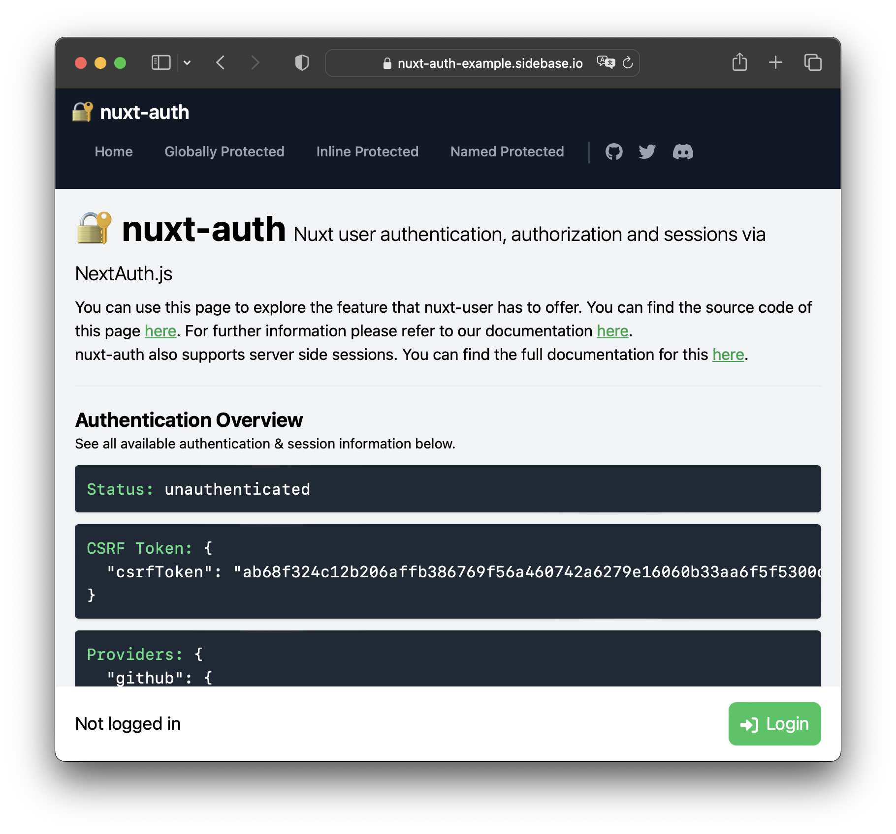

# 🔐 nuxt-auth

[![npm version][npm-version-src]][npm-version-href]
[![npm downloads][npm-downloads-src]][npm-downloads-href]
[](https://GitHub.com/sidebase/nuxt-auth/)
[![License][license-src]][license-href]
[](https://twitter.com/sidebase_io)
[](https://discord.gg/9MUHR8WT9B)


> Nuxt user authentication and sessions via [NextAuth.js](https://github.com/nextauthjs/next-auth). `nuxt-auth` wraps [NextAuth.js](https://github.com/nextauthjs/next-auth) to offer the reliability & convenience of a 12k star library to the nuxt 3 ecosystem with a native developer experience (DX).

## Quick Start

1. Install the package:
    ```sh
    npm i -D @sidebase/nuxt-auth
    ```
2. Add the package to your `nuxt.config.ts`:
    ```ts
    export default defineNuxtConfig({
      modules: ['@sidebase/nuxt-auth'],
    })
    ```
3. Create the authentication handler (`NuxtAuthHandler`) and add at least one [authentication provider](https://next-auth.js.org/providers/):
    ```ts
    // file: ~/server/api/auth/[...].ts
    import { NuxtAuthHandler } from '#auth'
    import GithubProvider from 'next-auth/providers/github'

    export default NuxtAuthHandler({
      providers: [
        // @ts-ignore Import is exported on .default during SSR, so we need to call it this way. May be fixed via Vite at some point
        GithubProvider.default({ clientId: 'enter-your-client-id-here', clientSecret: 'enter-your-client-secret-here' })
      ]
    })
    ```
    - `[..].ts` is a catch-all route, see the [nuxt server docs](https://v3.nuxtjs.org/guide/directory-structure/server#catch-all-route)
4. Done! You can now use all user-related functionality, for example:
    - application-side (e.g., from `.vue` files):
        ```ts
        const { status, data, signIn, signOut } = await useSession({
          // Whether a session is required. If it is, a redirect to the signin page will happen if no active session exists
          required: true
        })

        status.value // Session status: `unauthenticated`, `loading`, `authenticated`
        data.value // Session data, e.g., expiration, user.email, ...

        await signIn() // Sign in the user
        await signOut() // Sign out the user
        ```
    - server-side (e.g., from `~/server/api/session.get.ts`):
        ```ts
        import { getServerSession } from '#auth'

        export default eventHandler(async (event) => {
          const session = await getServerSession(event)
          if (!session) {
            return { status: 'unauthenticated!' }
          }
          return { status: 'authenticated!', text: 'im protected by an in-endpoint check', session }
        })
        ```

There's more supported methods in the `useSession` composable, you can create [universal-application-](https://v3.nuxtjs.org/guide/directory-structure/middleware) and [server-api-middleware](https://v3.nuxtjs.org/guide/directory-structure/server#server-middleware) that make use of the authentication status and more. All of this is [documented below](#documentation).

## Features

- ✔️ Authentication providers:
    - ✔️ OAuth (e.g., Github, Google, Twitter, Azure, ...)
    - ✔️ Custom OAuth (write it yourself)
    - ✔️ Credentials (password + username)
    - 🚧 Email Magic URLs
- ✔️ Isomorphic / Universal Auth Composable:
    - `useSession` composable to: `signIn`, `signOut`, `getCsrfToken`, `getProviders`, `getSession`
    - full typescript support for all methods and property
- ✔️ Persistent sessions across requests
- ✔️ Application-side middleware protection
- ✔️ Server-side middleware and endpoint protection
- ✔️ REST API:
    - `GET /signin`,
    - `POST /signin/:provider`,
    - `GET/POST /callback/:provider`,
    - `GET /signout`,
    - `POST /signout`,
    - `GET /session`,
    - `GET /csrf`,
    - `GET /providers`

`nuxt-auth` is actively maintained. The goal of this library is to reach feature-parity with `NextAuth.js`, see the current [status](#project-roadmap) below.

## Demo Page

Visit the [`nuxt-auth` demo page here](https://nuxt-auth-example.sidebase.io/):


You can find the [demo source-code here](https://github.com/sidebase/nuxt-auth-example).

## Documentation

The `nuxt-auth` module takes care of authentication and sessions:
- authentication: The process of ensuring that somebody is who they claims to be, e.g., via a username and password or by trusting an external authority (e.g., oauth via google, amazon, ...)
- sessions: Persist the information that you have been authenticated for some duration across different requests. Additional data can be attached to a session, e.g., a `username`. (Note: If you need only sessions but no authentication, you can check-out [nuxt-session](https://github.com/sidebase/nuxt-session))

In addition, you can use `nuxt-auth` to build authorization on top of the supported authentication + session mechanisms: As soon as you know "whos who", you can use this information to let somebody with the right email adress (for example) into a specific area. Right now, this is not in-scope of `nuxt-auth` itself.

If you want to have a more interactive introduction, check-out the [demo page](#demo-page) or the [module playground](#module-playground).

Below we describe:
1. [Configuration](#configuration)
    - [`nuxt.config.ts`](#nuxtconfigts)
        - [origin](#origin)
        - [basePath](#basepath)
    - [NuxtAuthHandler](#nuxtauthhandler)
        - [Example with two providers](#example-with-two-providers)
2. [Application-side usage](#application-side-usage)
    - [Session access and manipulation](#session-access-and-manipulation)
        - [Redirects](#redirects)
        - [Custom sign in page](#custom-sign-in-page)
    - [Middleware](#middleware)
        - [Global middleware](#global-middleware)
        - [Named middleware](#named-middleware)
        - [Inline middleware](#inline-middleware)
3. [Server-side usage](#server-side-usage)
    - [Server-side endpoint protection](#server-side-endpoint-protection)
    - [Server-side middleware](#server-side-middleware)
    - [Getting the JWT token](#getting-the-jwt-token)
        - [Application-side JWT token access](#application-side-jwt-token-access)
4. [REST API](#rest-api)
5. [Security](#security)
    - [Disclosure](#disclosure)
6. [Glossary](#glossary)
7. [Prior Work and Module Concept](#prior-work-and-module-concept)
    - [Project Roadmap](#project-roadmap)
8. [Module Playground](#module-playground)
9. [Development](#development)

### Configuration

There's two places to configure `nuxt-auth`:
- [`auth`-key in `nuxt.config.ts`](#nuxtconfigts): Configure the module itself, e.g., where the auth-endpoints are, what origin the app is deployed to, ...
- [NuxtAuthHandler](#nuxtauthhandler): Configure the authentication behavior, e.g., what authentication providers to use

For development, you can stay with the [Quick Start](#quick-start)-configuration.

For a production deployment, you will have to at least set the:
- `origin` inside the `nuxt.config.ts` config (equivalent to `NEXTAUTH_URL` environment variable),
- `secret` inside the `NuxtAuthHandler` config (equivalent to `NEXTAUTH_SECRET` environment variable)

#### `nuxt.config.ts`

Use the `auth`-key inside your `nuxt.config.ts` to configure the module itself. Right now this is limited to the following options:
```ts
export default defineNuxtConfig({
  modules: ['@sidebase/nuxt-auth'],
  auth: {
    // The module is enabled. Change this to disable the module
    // Note: Optional and true by default, don't include this line.
    isEnabled: true,

    // The origin is set to the development origin. Change this when deploying to production
    origin: 'http://localhost:3000',

    // The base path to the authentication endpoints. Change this if you want to add your auth-endpoints at a non-default location
    basePath: '/api/auth'
  }
})
```

The `origin` and the `basePath` together are equivalent to the `NEXTAUTH_URL` environment variable of NextAuth.js

##### origin

**You must set the `origin` in production, this includes when you run `npm run build`!** This is so that `nuxt-auth` can ensure that callbacks for authentication are correct. The `origin` consists out of (up to) 3 parts:
- scheme: `http` or `https`
- host: e.g., `localhost`, `example.org`, `www.sidebase.io`
- port: e.g., `:3000`, `:4444`; leave empty to implicitly set `:80` (this is an internet convention, don't ask)

For [the demo-app](https://nuxt-auth-example.sidebase.io) we set the `origin` to `https://nuxt-auth-example.sidebase.io`. If for some reason required, you can explicitly set the `origin` to `http://localhost:3000` to stop `nuxt-auth` from aborting `npm run build` when the origin is unset.

##### basePath

This is what tells the module where you added the authentication endpoints. Per default the `basePath` is set to `/api/auth`, so that means that the module expects that all requests to `/api/auth/*` will be handled by the `NuxtAuthHandler`.

To statify this, you need to create a [catch-all server-route](https://v3.nuxtjs.org/guide/directory-structure/server#catch-all-route) at that location by creating a file `~/server/api/auth/[...].ts` that exports the `NuxtAuthHandler`, see more on this in the [Quick Start](#quick-start) or in the [configuration section below](#serverapiauthts).

If you want to have the authentication at another location, you can overwrite the `basePath`, e.g., when setting:
- `basePath: "/api/_auth"` -> add the authentication catch-all endpoints into `~/server/api/_auth/[...].ts`
- `basePath: "/_auth"` -> add the authentication catch-all endpoints into `~/server/routes/_auth/[...].ts` (see [Nuxt server-routes docs on this](https://v3.nuxtjs.org/guide/directory-structure/server/#server-routes))

#### NuxtAuthHandler

Use the `NuxtAuthHandler({ ... })` to configure how the authentication itself behaves:
```ts
// file: ~/server/api/auth/[...].ts
import { NuxtAuthHandler } from '#auth'

export default NuxtAuthHandler({
  // your authentication configuration here!
})
```

The `NuxtAuthHandler` accepts [all options that NextAuth.js accepts for its API initialization](https://next-auth.js.org/configuration/options#options). Use this place to configure authentication providers (oauth-google, credential flow, ...), your `secret` (equivalent to `NEXTAUTH_SECRET` in NextAuth.js), add callbacks for authentication events, configure a custom logger and more. Read the linked `NextAuth.js` configuration to figure out how this works and what you can do.

##### Example with two providers

Here's what a full config can look like, wee allow authentication via a:
- Github Oauth flow
- a username + password flow (called `CredentialsProvider`)
- Strapi JWT example with the `CredentialsProvider`

Note that the below implementation of the credentials provider is flawed and mostly copied over from the [NextAuth.js credentials example](https://next-auth.js.org/configuration/providers/credentials) in order to give a picture of how to get started with the credentials provider:
```ts
// file: ~/server/api/auth/[...].ts
import CredentialsProvider from 'next-auth/providers/credentials'
import GithubProvider from 'next-auth/providers/github'
import { NuxtAuthHandler } from '#auth'

export default NuxtAuthHandler({
  providers: [
    // @ts-ignore Import is exported on .default during SSR, so we need to call it this way. May be fixed via Vite at some point
    GithubProvider.default({
      clientId: 'your-client-id',
      clientSecret: 'your-client-secret'
    }),
    // @ts-ignore Import is exported on .default during SSR, so we need to call it this way. May be fixed via Vite at some point
    CredentialsProvider.default({
      // The name to display on the sign in form (e.g. 'Sign in with...')
      name: 'Credentials',
      // The credentials is used to generate a suitable form on the sign in page.
      // You can specify whatever fields you are expecting to be submitted.
      // e.g. domain, username, password, 2FA token, etc.
      // You can pass any HTML attribute to the <input> tag through the object.
      credentials: {
        username: { label: 'Username', type: 'text', placeholder: '(hint: jsmith)' },
        password: { label: 'Password', type: 'password', placeholder: '(hint: hunter2)' }
      },
      authorize (credentials: any) {
        // You need to provide your own logic here that takes the credentials
        // submitted and returns either a object representing a user or value
        // that is false/null if the credentials are invalid.
        // NOTE: THE BELOW LOGIC IS NOT SAFE OR PROPER FOR AUTHENTICATION!

        const user = { id: '1', name: 'J Smith', username: 'jsmith', password: 'hunter2' }

        if (credentials?.username === user.username && credentials?.password === user.password) {
          // Any object returned will be saved in `user` property of the JWT
          return user
        } else {
          // eslint-disable-next-line no-console
          console.error('Warning: Malicious login attempt registered, bad credentials provided')

          // If you return null then an error will be displayed advising the user to check their details.
          return null

          // You can also Reject this callback with an Error thus the user will be sent to the error page with the error message as a query parameter
        }
      }
    })
  ]
})
```

##### Example with a custom Strapi JWT provider 

Here's what a full config can look like, wee allow authentication via:
- Strapi v4 JWTs with the `CredentialsProvider`

Note that the below implementation of the credentials provider stores the Strapi JWT in the profile field of the user. The user object will be wrapped inside the session. Sidenote: the session has it's own JWT. Sending the Nuxt-Auth session JWT token as bearer token will not work, you need to pass the token that is originally returned by Strapi to get authorised accessing any auth enabled resources on your Strapi Server.

For development, you can stay with the [Quick Start](#quick-start)-configuration.

There's three places to configure `nuxt-auth` to work with Strapi:
- `STRAPI_BASE_URL` in `.env`: Add the Strapi environment variable to your .env file.
- [`runtimeConfig.STRAPI_BASE_URL`-key in `nuxt.config.ts`](#nuxtconfigts): Add the Strapi base url env variable. 
- [`runtimeConfig.STRAPI_API_TOKEN_SECRET`-key in `nuxt.config.ts`](#nuxtconfigts): Optional: Allows server-to-server/machine-to-machine/headless usage through Strapi API Tokens. 
- [`auth`-key in `nuxt.config.ts`](#nuxtconfigts): Configure the module itself, e.g., where the auth-endpoints are, what origin the app is deployed to, ...
- [NuxtAuthHandler](#nuxtauthhandler): Configure the authentication behavior, e.g., what authentication providers to use


For a production deployment, you will have to at least set the:
- `origin` inside the `nuxt.config.ts` config (equivalent to `NEXTAUTH_URL` environment variable),
- `secret` inside the `NuxtAuthHandler` config (equivalent to `NEXTAUTH_SECRET` environment variable)
- `STRAPI_BASE_URL` Strapi base URL for all API endpoints by default http://localhost:1337 
- `STRAPI_API_TOKEN_SECRET` optional, but required for server-to-server and/or headless usage.

In your .env file add the following line:
```ts
// Strapi v4 url, out of the box
 STRAPI_BASE_URL=http://localhost:1337/api
 STRAPI_API_TOKEN_SECRET=optional
```

In your `nuxt.config.ts` file, configure it like the following
```ts
export default defineNuxtConfig({
  runtimeConfig: {
    // The private keys which are only available server-side
    NUXT_SECRET: process.env.NUXT_SECRET,
    // Default http://localhost:1337/api
    STRAPI_BASE_URL: process.env.STRAPI_BASE_URL,
    // Optional but required for server-to-server ops
    STRAPI_APITOKEN_SECRET:process.env.STRAPI_APITOKEN_SECRET
  },
  auth: {
    origin: process.env.ORIGIN,
  },
});

```

Create the catch-all nitro route and add the this custom Strapi credentials provider.
```ts
// file: ~/server/api/auth/[...].ts
import CredentialsProvider from "next-auth/providers/credentials";
import { NuxtAuthHandler } from "#auth";

export default NuxtAuthHandler({
  // secret needed to run nuxt-auth in production mode (used to encrypt data)
  secret: process.env.NUXT_SECRET,
  providers: [
    // @ts-ignore Import is exported on .default during SSR, so we need to call it this way. May be fixed via Vite at some point
    CredentialsProvider.default({
      name: "Credentials",
      credentials: {
        username: { label: "Username", type: "text", placeholder: "Test user" },
        password: { label: "Password", type: "password" },
      },
      async authorize(credentials: any) {
        
        const user = await $fetch(
          `${process.env.STRAPI_BASE_URL}/auth/local/`,
          {
            method: "POST",
            body: JSON.stringify({
              identifier: credentials.username,
              password: credentials.password,
            }),
          }
        );

        if (user) {
          const u = {
            id: user.user.id,
            name: user.user.username,
            email: user.user.email,
            // Passing OG JWT through the email field.
            // IMPORTANT: Always pass around encoded JWTs,
            // don't pass around decoded JWTs.
            profile: user.jwt
          };
          return u;
        } else {
          return null;
        }
      },
    }),
  ],
  session: {
    jwt: true,
  }
});
```

###### Passing the headers after authenticating. 

After setting up the authentication flow and when authenticated in the browser.
We need to supply the cookie headers to Nitro in our fetch calls to access auth protected Strapi resources.
- Create a useFetch or $fetch request that calls Nitro that includes the session cookie headers.
- In order to gain access to your protected Strapi endpoints, we need to extract the user object from the session server side in nitro using the getToken function.
- Finally we add the JWT token stored in the session user object as auth headers for our fetch request to Strapi.

Add the following fetch request in e.g. your admin dashboard section of your Nuxt app.

```ts
const headers = useRequestHeaders(['cookie'])
const { data, pending, error, refresh } = await useFetch(`/api/admin/data`, { headers: { cookie: headers.cookie } });
```
We're gonna call this admin resource API after authentication next, after we have created it on the next step.

###### Creating a nitro endpoint for authenticated calls. 

1. Add a folder called admin in the `./server/api/` folder for ths example.

2. Inside the admin folder create a new nitro endpoint called `data.get.ts`. Add the following code.
```ts
import { getToken, getServerSession } from "#auth";

export default defineEventHandler(async (event) => {
  const session = await getServerSession(event);
  if (!session) return { status: "unauthenticated!" };

  const config = useRuntimeConfig();
  const token = await getToken({ event });
  const query = await useQuery(event);

  const settings = {
    method: "GET",
    headers: {
      "Content-Type": "application/json",
      // Ensure that the JWT tokens are encoded, when you are passing it around.
      Authorization: "Bearer " + token.profile,
    },
  };

  const { data } = await $fetch(
    `${config.STRAPI_BASE_URL}/<protected-strapi-resources>?populate=*`,
    settings
  );
  return data;
});

```

This is the end of Strapi example section.

### Application-side usage

This module allows you user-data access, signing in, signing out and more [via `useSession`](#session-access-and-manipulation). It also allows you to defined [middleware that protects pages](#middleware).

Application-side usage refers to any code like pages, components or composables that are part of the universal server- and client-side rendering of Nuxt, see more in the [glossary](#glossary).

#### Session access and manipulation

The `useSession` composable is your main gateway to accessing and manipulating session-state and data. Here's the main methdos you can use:

```ts
const {
  status,
  data,
  getCsrfToken,
  getProviders,
  getSession,
  signIn,
  signOut,
} = await useSession({
  // Whether a session is required. If it is, a redirect to the signin page will happen if no active session exists
  required: true
})

// Session status, either `unauthenticated`, `loading`, `authenticated`, see https://next-auth.js.org/getting-started/client#signout
status.value

// Session data, either `undefined` (= authentication not attempted), `null` (= user unauthenticated), `loading` (= session loading in progress), see https://next-auth.js.org/getting-started/client#signout
data.value

// Get / Reload the current session from the server, pass `{ required: true }` to force a login if no session exists, see https://next-auth.js.org/getting-started/client#getsession
await getSession()

// Get the current CSRF token, usually you do not need this function, see https://next-auth.js.org/getting-started/client#signout
await getCsrfToken()

// Get the supported providers, e.g., to build your own login page, see https://next-auth.js.org/getting-started/client#getproviders
await getProviders()

// Trigger a sign in, see https://next-auth.js.org/getting-started/client#signin
await signIn()

// Trigger a sign in with a redirect afterwards, see https://next-auth.js.org/getting-started/client#signin
await signIn(undefined, { callbackUrl: '/protected' })

// Trigger a sign in via a specific authentication provider with a redirect afterwards, see https://next-auth.js.org/getting-started/client#signin
await signIn('github', { callbackUrl: '/protected' })

// Trigger a sign in with username and password already passed, e.g., from your own custom-made sign-in form
await singIn('credentials', { username: 'jsmith', password: 'hunter2' })

// Trigger a sign out, see https://next-auth.js.org/getting-started/client#signout
await signOut()

// Trigger a sign out and send the user to the sign out page afterwards
await signOut({ calbackUrl: '/signout' })
```

Session `data` has the following interface:
```ts
interface DefaultSession {
  user?: {
    name?: string | null;
    email?: string | null;
    image?: string | null;
  };
  expires: ISODateString;
}
```

Note that this is only set when the use is logged-in and when the provider used to login the user provides the fields.

##### Redirects

You can also pass the `callbackUrl` option to both the `signIn` and the `signOut` method. This allows you to redirect a user to a certain pages, after they've completed the action. This can be useful when a user attempts to open a page (`/protected`) but has to go through external authentication (e.g., via their google account) first.

You can use it like:
```ts
await signIn({ callbackUrl: '/protected' })
```

to redirect the user to the protected page they wanted to access _after_ they've been authenticated.

You can do the same for signing out the user:
```ts
await signOut({ callbackUrl: '/protected' })
```

E.g., here to redirect the user away from the already loaded, protected, page after signout (else, you will have to handle the redirect yourself).

##### Custom sign in page

To create your custom sign-in page you can use `signIn` to directly start a provider-flow once the user selected it, e.g., by clicking on a button on your custom sign-in page. Here is a very simple sign-in page that either directly starts a github-oauth sign in flow or directly signs in the user via the credentials flow:
```vue
<template>
  <div>
    <p>Sign In Options</p>
    <button @click="signIn('github')">Github</button>
    <!-- NOTE: Here we hard-coded username and password, on your own page this should probably be connected to two inputs for username + password -->
    <button @click="signIn('credentials', { username: 'test', password: 'hunter2' })">Username and Password</button>
  </div>
</template>

<script setup lang="ts">
const { signIn } = await useSession({ required: false })
</script>
```

Note: In the above example `username` and `password` are hard-coded. In your own custom page, these two fields should probably come from inputs on your page.

If you want to create a custom sign-in page that dynamically offers sign-in options based on your configured providers, you can call `getProviders()` first and then iterate over the supported providers to generate your sign in page.

#### Middleware

You can use this library to define application middleware. This library supports all of [Nuxt's supported middleware approaches](https://v3.nuxtjs.org/guide/directory-structure/middleware#middleware-directory). In all methods shown below we make use of the `callbackUrl` parameter to give the best user experience: If the user is not authenticated, they are forced to login, but will be redirected to the same page they wanted to visit after they successfully logged in. Without a `callbackUrl` parameter, the user would be directed to the index page `/`.

##### Global middleware

Create a global authentication middleware that ensures that your user is authenticated no matter which page they visit. Create a file in the `middleware` directory that has a `.global.ts` suffix.

It should look like this:

```ts
// file: ~/middleware/auth.global.ts
export default defineNuxtRouteMiddleware(async (to) => {
  await useSession({ callbackUrl: to.path })
})
```

That's it! This middleware will fetch a session and if no active session exists for the current user redirect to the login screen. If you want to write custom redirect logic, you could alter the above code to only apply to specific routes.

Here is a global middleware that protects only the routes that start with `/secret/`:
```ts
// file: ~/middleware/auth.global.ts
export default defineNuxtRouteMiddleware(async (to) => {
  if (to.path.startsWith('/secret/')) {
    await useSession({ callbackUrl: to.path })
  }
})
```

Example of a middleware that redirects to a custom login page:
```ts
// file: ~/middleware/auth.global.ts
export default defineNuxtRouteMiddleware(async (to) => {
  // 1. Always allow access to the login page
  if (to.path === '/login') {
    return
  }

  // 2. Otherwise: Check status and redirect to login page
  const { status } = await useSession({ required: false })
  if (status.value !== 'authenticated') {
    navigateTo('/login')
  }
})
```

##### Named middleware

Named middleware behave similar to [global middleware](#global-middleware) but are not automatically applied to any pages.

To use them, first create a middleware:
```ts
// file: ~/middleware/auth.ts
export default defineNuxtRouteMiddleware(async (to) => {
  await useSession({ callbackUrl: to.path })
})
```

Then inside your pages use the middleware with `definePageMeta`:
```vue
<!-- file: ~/pages/protected.vue -->
<template>
  <div>I'm a secret!</div>
</template>

<script setup lang="ts">
definePageMeta({
  middleware: ['auth']
})
</script>
```

Note: `definePageMeta` can only be used inside the `pages/` directory.

Nuxt now calls the `auth.ts` middleware on every visit to this page.

##### Inline middleware

To define a named middleware, you need to use `definePageMeta` as described [in the nuxt docs](https://v3.nuxtjs.org/api/utils/define-page-meta/). Then you can just call `useSession` as in the other middleware. Here's an example that would protect just the page itself:
```vue
<!-- file: ~/pages/protected.vue -->
<template>
  <div>I'm a secret!</div>
</template>

<script setup lang="ts">
definePageMeta({
  middleware: async () => {
    await useSession({ callbackUrl: '/protected' })
  }
})
</script>
```

Note: `definePageMeta` can only be used inside the `pages/` directory

#### Server-side usage

On the server side you can get access to the current session like this:
```ts
import { getServerSession } from '#auth'

export default eventHandler(async (event) => {
  const session = await getServerSession(event)
})
```

This is inspired by [the getServerSession](https://next-auth.js.org/tutorials/securing-pages-and-api-routes#securing-api-routes) of NextAuth.js. It also avoids an external, internet call to the `GET /api/auth/sessions` endpoint, instead directly calling a pure JS-method.

##### Server-side endpoint protection

To protect an endpoint with, check the session after fetching it:
```ts
// file: ~/server/api/protected.get.ts
import { getServerSession } from '#auth'

export default eventHandler(async (event) => {
  const session = await getServerSession(event)
  if (!session) {
    return { status: 'unauthenticated!' }
  }
  return { status: 'authenticated!' }
})

```

##### Server-side middleware

You can also use this in a [Nuxt server middleware](https://v3.nuxtjs.org/guide/directory-structure/server#server-middleware) to protect multiple pages at once and keep the authentication logic out of your endpoints:
```ts
// file: ~/server/middleware/auth.ts
import { getServerSession } from '#auth'

export default eventHandler(async (event) => {
  const session = await getServerSession(event)
  if (!session) {
    throw createError({ statusMessage: 'Unauthenticated', statusCode: 403 })
  }
})
```

##### Getting the JWT Token

Getting the (decoded) JWT token of the current user can be helpful, e.g., to use it to access an external api that requires this token for authentication or authorization.

You can get the JWT token that was passed along with the request using `getToken`:
```ts
// file: ~/server/api/token.get.ts
import { getToken } from '#auth'

export default eventHandler(async (event) => {
  const token = await getToken({ event })

  return token || 'no token present'
})
```

The function behaves identical to the [`getToken` function from NextAuth.js](https://next-auth.js.org/tutorials/securing-pages-and-api-routes#using-gettoken) with one change: you have to pass in the h3-`event` instead of `req`. This is due to how cookies can be accessed on h3: not via `req.cookies` but rather via `useCookies(event)`.

You do not need to pass in any further parameters like `secret`, `secureCookie`, ... They are automatically inferred to the values you configured if not set and reading the token will work out of the box. You _may_ pass these options, e.g., to get the raw, encoded JWT token you can pass `raw: true`.

###### Application-side JWT token access

To access the JWT token application-side, e.g., in a `.vue` page, you can create an endpoint like this:
```ts
// file: ~/server/api/token.get.ts
import { getToken } from '#auth'

export default eventHandler(event => getToken({ event }))
```

Then from your application-side code you can fetch it like this:
```vue
// file: app.vue
<template>
  <div>{{ token || 'no token present, are you logged in?' }}</div>
</template>

<script setup lang="ts">
const headers = useRequestHeaders(['cookie'])
const { data: token } = await useFetch('/api/token', { headers: { cookie: headers.cookie } })
</script>
```

Note that you have to pass the cookie-header manually. You also have to pass it using [`useRequestHeaders`](https://v3.nuxtjs.org/api/composables/use-request-headers/) so that the cookies are also correctly passed when this page is rendered server-side during the [universal-rendering process](https://v3.nuxtjs.org/guide/concepts/rendering#universal-rendering).

#### REST API

All endpoints that NextAuth.js supports are also supported by `nuxt-auth`:
- `GET /signin`,
- `POST /signin/:provider`,
- `GET/POST /callback/:provider`,
- `GET /signout`,
- `POST /signout`,
- `GET /session`,
- `GET /csrf`,
- `GET /providers`

You can directly interact with them if you wish to, it's probably a better idea to use `useSession` where possible though. [See the full rest API documentation of NextAuth.js here](https://next-auth.js.org/getting-started/rest-api).

#### Security

This section mostly contains a list of possible security problems. Note that the below flaws exist with many libraries and frameworks we use in our day-to-day when building and working with APIs. Even your vanilla Nuxt app already posesses some of these shortcoming. Missing in the below list are estimates of how likely it is that one of the list-items may occur and what impact it will have on your app. This is because that heavily depends on:
- your app: Are you building a fun project? A proof of concept? The next fort-nox money management app?
- your environment: Building a freely available app for fun? Have authentication in front of your app and trust all users that successfully authenticated? Superb! Don't trust anyone? Then please be extra-careful when using this library and when building you backend in general

Without further ado, here's some attack cases you can consider and take action against. Neither the attack vectors, the problems or the mitigations are exhaustive:
1. sending arbitrary data: Denial-of-Service by server-ressource exhaustion (bandwidth, cpu, memory), arbitrary code execution (if you parse the data), ...
2. creation arbitrarily many sessions: Denial-of-Service by server-ressource exhaustion (bandwidth, cpu, memory)
3. guessing correct session ids: session data can leak
4. stealing session id(s) of client(s): session data can leak

Read up how to mitigate these and more issues if you see fit. Checkout the [`nuxt-security`](https://github.com/Baroshem/nuxt-security) module that may help with some of these.

##### Disclosure

A last reminder: This library was not written by crypto- or security-experts. Please proceed at your own risk, inspect the code if you want to and open issues / pull requests where you see room for improvement. If you want to file a security-concern privately, please send an email to `support@sidestream.tech` with the subject saying "SECURITY nuxt-auth" and we'll look into your request ASAP.

#### Glossary

There are some terms we use in this documentation that may not immeadiatly be known to every reader. Here is an explanation for some of them:
- `application` / `application-side` / `universal-application`: This references all Nuxt code of your app that is [universally rendered](https://v3.nuxtjs.org/guide/concepts/rendering#universal-rendering). In short this means that that code is rendered on the server-side and on the client-side, so all JS in it is executed twice. This is an important distinction, as some things may behave different on the server-side than on the client-side. We use `application...` to denote something that will be universally rendered
- `server` / `server-side`: This references all Nuxt code of your app that will run **only** on your server. For example, all code inside the `~/server` directory should only ever run on the server

#### Prior Work and Module Concept

The idea of this library is to re-use all the open-source implementation that already exist in the JS ecosystem instead of rolling our own. The idea was born when researching through the ecosystem of framework-specific authentication libraries to figure out what the best implementation approach for a state-of-the-art Nuxt 3 authentication library would be.

During research it became clear that implementing everything from scratch will be:
- a lot of work that has already been open-sourced by others,
- error prone as authentication has a lot of intricacies that need to be resolved in order to get it right,
- hard to maintain as authentication providers come and go,
- hard to build initial trust for as authentication is important and cannot go wrong,

In order to avoid these problems without taking forever (leaving Nuxt without an authentication library in the meantime), we decided to investigate if we can wrap [`NextAuth.js`](https://github.com/nextauthjs/next-auth), the most popular authentication library in the Next.js ecosystem by far and a trusted, well maintained one at that!

In our investigation we found prior attempts to make NextAuth.js framework agnostic. These have more or less come to fruition, so far mostly resulting in some PoCs and example apps. Looking at these was quite helpful to get started. In particular, big pushes in the right direction came from:
- [NextAuth.js app examples](https://github.com/nextauthjs/next-auth/tree/main/apps)
- [Various comments, proposals, ... of this thread](https://github.com/nextauthjs/next-auth/discussions/3942), special thanks to @brillout for starting the discussion, @balazsorban44 for NextAuth.js and encouraging the discussion, @wobsoriano for adding PoCs for multiple languages

The main part of the work was to piece everything together, resolve some outstanding issues with existing PoCs, add new things where nothing existed yet, e.g., for the `useSession` composable by going through the NextAuth.js client code and translating it to a Nuxt 3 approach.

##### Project Roadmap

This project is under active development: A lot of stuff already works and as NextAuth.js handles the authentication under the hood, the module should already be ready for most use-cases. Still, some functionality is missing, e.g., we've focused on oauth-providers in the first implementation, so the credential- and email-flow are untested.

Roughly, the priorities of `nuxt-auth` are:
1. Reach feature parity: There's some options, configuration and behavior from NextAuth.js that we do not support yet. We first want to reach feature parity on this. If any missing feature is of particular relevance to you: [Open an issue](https://github.com/sidebase/nuxt-auth/issues/new)
2. Add some of our own: There's ideas we have to support extended user management, e.g., discuss whether we want to better support the `local` / `credentials` flow than NextAuth.js does out of the box (they don't do it for good reasons, so, there really is an honest discussion to be had), adding more UI focused components that automatically and easily wrap your app in a nice auth page, ...

We also want to listen to all suggestions, feature requests, bug reports, ... from you. So if you have any ideas, please open an issue or reach out to us on Twitter or via E-Mail.

#### Module Playground

This module also has it's own playground, you can also use that to get familiar with it and play around a bit:
```sh
> git clone https://github.com/sidebase/nuxt-auth

> cd nuxt-auth

# **OPEN THE `~/playground/server/api/auth/[...].ts` and configure your own auth-provider

> npm i

> npm run dev:prepare

> npm run dev

# -> open http://localhost:3000
```

Note: The playground has considerably less polishing than the example page.

#### Development

- Run `npm run dev:prepare` to generate type stubs.
- Use `npm run dev` to start [the module playground](./playground) in development mode.
- Run `npm run lint` to run eslint
- Run `npm run type` to run typescheck via tsc
- Run `npm publish --access public` to publish (bump version before)

<!-- Badges -->
[npm-version-src]: https://img.shields.io/npm/v/@sidebase/nuxt-auth/latest.svg
[npm-version-href]: https://npmjs.com/package/@sidebase/nuxt-auth

[npm-downloads-src]: https://img.shields.io/npm/dt/@sidebase/nuxt-auth.svg
[npm-downloads-href]: https://npmjs.com/package/@sidebase/nuxt-auth

[license-src]: https://img.shields.io/npm/l/@sidebase/nuxt-auth.svg
[license-href]: https://npmjs.com/package/@sidebase/nuxt-auth
